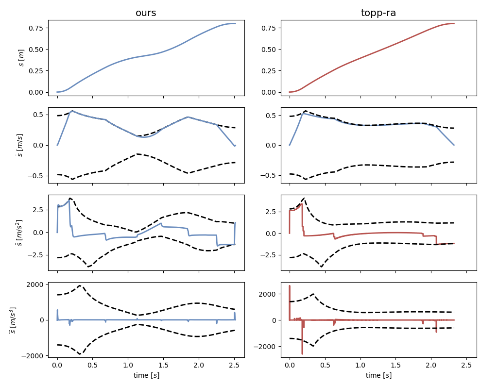
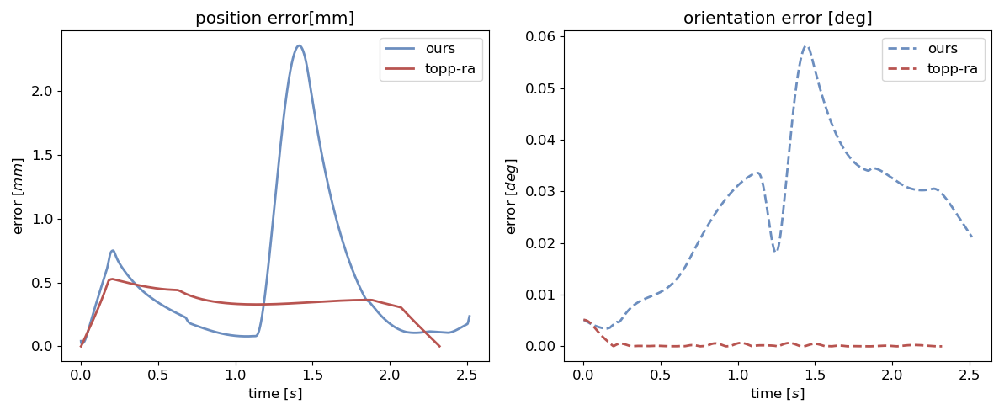

# Online approach to near time-optimal task-space trajectory planning

This repo brings the comparison of the proposed Cartesian Space trajectory planning approach against [toppra](https://github.com/hungpham2511/toppra). 
The method is based on Trapezoidal Acceleration Profile (TAP) planning which is implemented using [ruckig](https://github.com/pantor/ruckig)

The method is described more in detail within the [preprint](https://inria.hal.science/hal-03791783/document).

## Interactive simulation 

Now available in the form of the Hugging Face space:  https://askuric-capacity-aware-trajectory-planning.hf.space/


## Installation
The code is implemented in Python and we strongly suggest to use anaconda to install the necessary libraries. 

You can install the dependencies using:
```
conda env create -f env.yaml
```

And then activate the environment 
```
conda activate planning_env
```

## Pynocchio

This code uses a custom wrapper over pinocchio library called `pynocchio` which can be found [here](https://github.com/askuric/pynocchio).

## Launch the code
To access the code launch the jupyter lab 

```
jupyter lab
```

and launch the notebook: 
- `comparison_with_toppra_rtb.ipynb` - using robotics-toolbox-python for the robot simulation
- `comparison_with_toppra_pin.ipynb` - using pinocchio for the robot simulation


You can also run the comparison script directly using:
```
python comparison_with_toppra_pin.py
```

And then follow the instructions within the script and see the plots and robot animation.

https://github.com/user-attachments/assets/48ea5ccb-9eb6-473b-8b22-c7f71743eb8b


For example comparing the two approaches position, velocity, acceleration and jerk profiles on the given trajectory:

and the error between the two approaches:



You will also be able to see the side-by-side animation of the two robots following the same trajectory where the left robot is using our approach and the right robot is using toppra approach.


https://github.com/user-attachments/assets/a0e71abf-0613-4763-a571-f4f69cf36507
